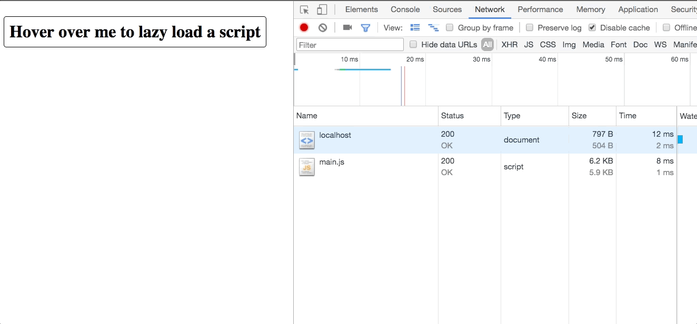

# Demo

This is a demo to show how to lazy load modules based on user actions, such as mouse hovering.

# Getting started

```shell
npm install
# Download dependencies

npm run start
# Run webpack and start Express server

# Open up a web browser and go to localhost:3000
```

# Explanation



In the network tab, we can see an HTML and JavaScript file getting downloaded.

When the user hovers over the text (mouse is not shown in the gif), a request is made to fetch and execute `anotherModule`.

You can see the request in the Network tab, and see that the other JavaScript file updates the DOM.
